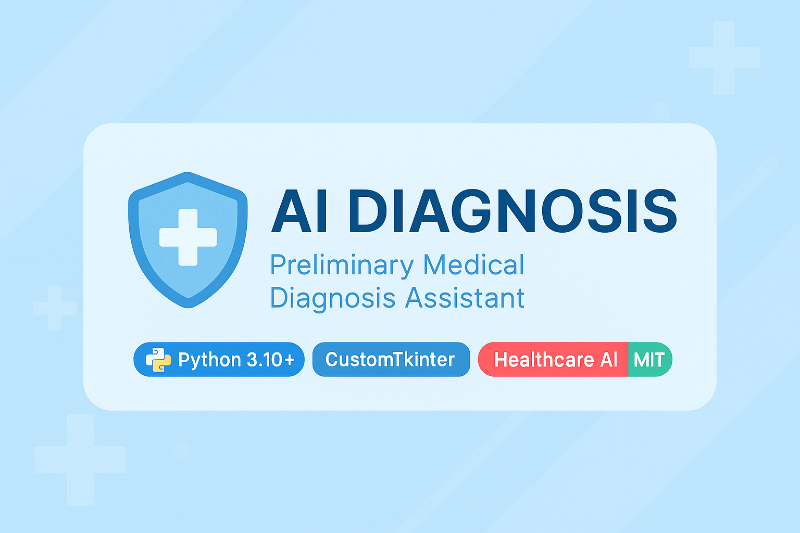
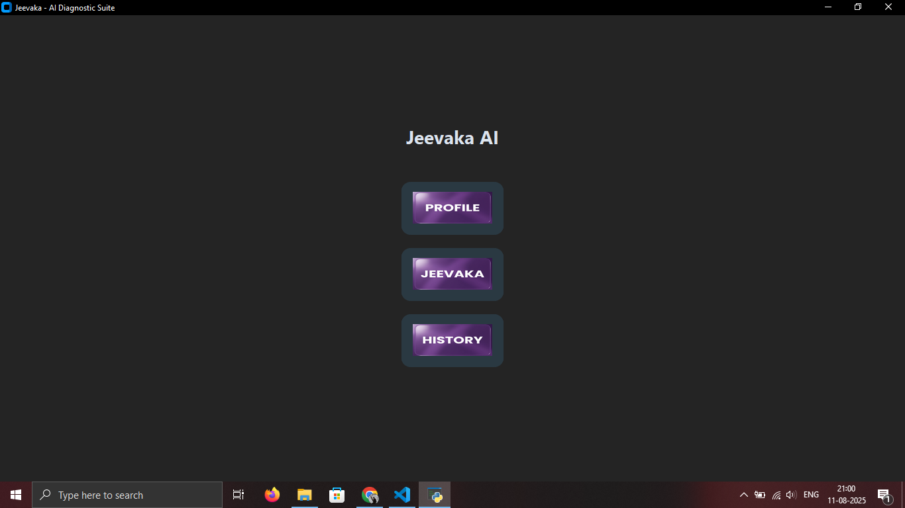
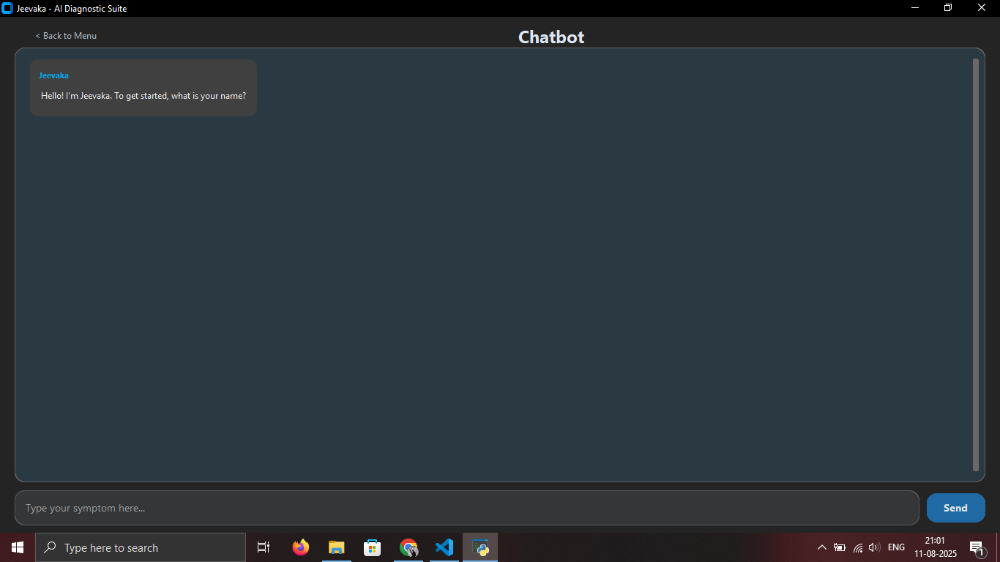
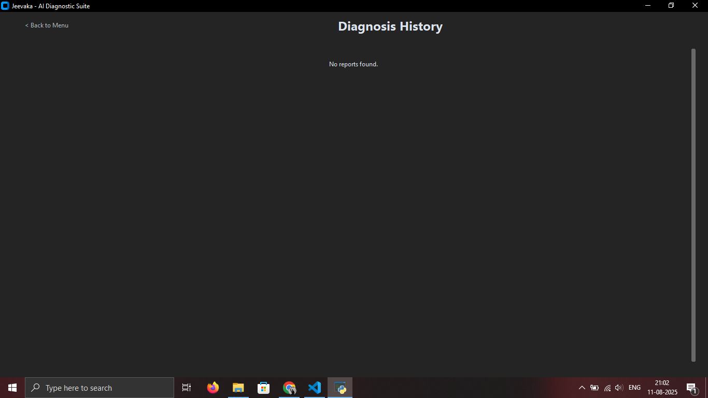

# 🩺 Jeevaka – AI-Based Medical Diagnosis Assistant

  
_A modern AI-powered assistant for preliminary medical diagnosis._


## 📌 Overview
**Jeevaka** is an **AI-powered medical diagnosis assistant** that interacts with users in a friendly chat interface to collect symptoms and provide preliminary AI-driven health insights.  
This project combines **NLP**, **custom GUI design**, and **machine learning** to make medical assistance more accessible.  

⚠ **Disclaimer**: This tool is for **educational purposes only** and should not be used as a substitute for professional medical advice.

---

## ✨ Features
- 💬 **Interactive Chatbot** – Conversational interface to collect symptoms.
- 🌍 **Location-Aware** – Displays a map for the user's city.
- 🩺 **AI Diagnosis** – Suggests possible conditions based on symptoms.
- 📂 **Report Generation** – Saves diagnosis history in neatly formatted text files.
- 🎨 **Modern UI** – Glassmorphic, dark-themed interface with icons.
- 📜 **History View** – View and open past diagnosis reports.

---

## 🖥 Screenshots


| Main Menu | Chatbot Interface | Report History | 
|-----------|------------------|----------------|
|  |  |  |

---

## 🛠 Tech Stack
- **Python 3.10+**
- **CustomTkinter** – Modern, themed UI framework for Tkinter
- **Pillow** – Image processing
- **Geopy** – Location geocoding
- **TkinterMapView** – Embedded map widget
- **Machine Learning Model** – For diagnosis logic

---

## 📦 Installation

1. **Clone the repository**  
```bash
git clone https://github.com/Ronitraj07/AI-Diagnosis.git
cd AI-Diagnosis
````

2. **Install dependencies**

```bash
pip install -r requirements.txt
```

3. **Run the application**

```bash
python app/gui.py
```

---

## 📁 Project Structure

```
AI-Diagnosis/
│
├── app/
│   ├── gui.py               # Main GUI application
│   ├── assets/              # Icons, background images
│
├── model/
│   ├── model.py              # AI diagnosis logic
│
├── reports/                  # Generated diagnosis reports
├── requirements.txt
├── README.md
```

---

## 🧠 How It Works

1. **Profile Setup** – User enters name, age, and city.
2. **Symptom Collection** – The chatbot guides the user to enter symptoms.
3. **Diagnosis** – AI model processes symptoms and suggests possible conditions.
4. **Report Saving** – Saves a timestamped report for future reference.

---

## 🚀 Future Improvements

* 🧬 More accurate diagnosis with advanced ML models.
* 📊 Visual report summaries with charts.
* 🌐 Multi-language support.
* 🖼 Enhanced UI animations.

---

## 📜 License

This project is licensed under the **MIT License** – you are free to use, modify, and distribute with attribution.

---

**Made with ❤️ for healthcare accessibility and innovation.**
